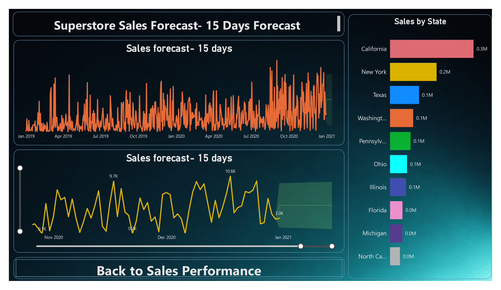
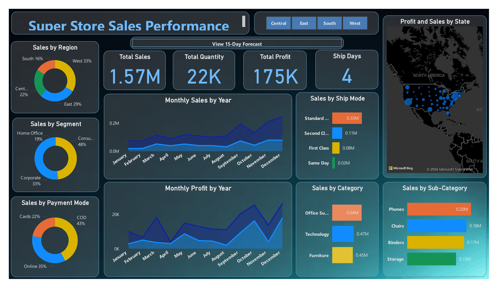

# 📊 Superstore Sales Dashboard

## 🔎 Project Overview
This project showcases a **Power BI dashboard** built on the Superstore Sales dataset.  
It provides insights into **sales performance, profit trends, shipping modes, and customer segments**, along with a **15‑day forecast by state**.  
Interactive features like **page navigation** make the dashboard dynamic and user‑friendly.

---

## 📂 Repository Structure
- **data/** → Superstore Sales dataset  
- **dashboard/** → Power BI files (`.pbix`) and PDF report  
- **images/** → Visuals and screenshots of dashboards  
- **notebook/** → Supporting notebooks or analysis scripts  
- **README.md** → Documentation explaining project overview, features, and usage  
- **.gitignore** → Specifies files ignored by Git version control  

---

## 📑 Data
- [SuperStore_Sales_DataSet.xlsx](data/SuperStore_Sales_DataSet.xlsx)

---

## 📊 Dashboard
- [Superstore_sales_performance_and_forecaste.pbix](dashboard/Superstore_sales_performance_and_forecaste.pbix)  
- [Superstore_sales_dashboard.pdf](dashboard/Superstore_sales_dashboard.pdf)

---

## 🖼️ Dashboard Preview
  

---

## 📈 Key Features
- Regional **sales performance analysis** with KPIs (Sales, Profit, Quantity, Ship Days)  
- **Profit & sales trends** across categories and sub‑categories  
- Comparison of **shipping modes** and **payment methods**  
- Customer **segment insights** (Consumer, Corporate, Home Office)  
- **15‑day forecast by state** with interactive charts  
- **Page navigation buttons** for smooth exploration between dashboards  

---

## 🚀 Usage
1. Clone the repository.  
2. Download the `.pbix` file from the `dashboard/` folder.  
3. Open it in **Power BI Desktop**.  
4. Explore interactive visuals and navigate pages using built‑in buttons.  
5. Refer to the PDF report for a static overview.  

---

## 📝 Notes
- Dataset is included for reproducibility.  
- Forecast visuals are generated using Power BI’s built‑in forecasting tools.  
- Dashboard screenshots are available in the `images/` folder for quick preview.  

---

## 📜 License
This project is shared for educational and portfolio purposes.  
You may view and explore the dashboard freely.
